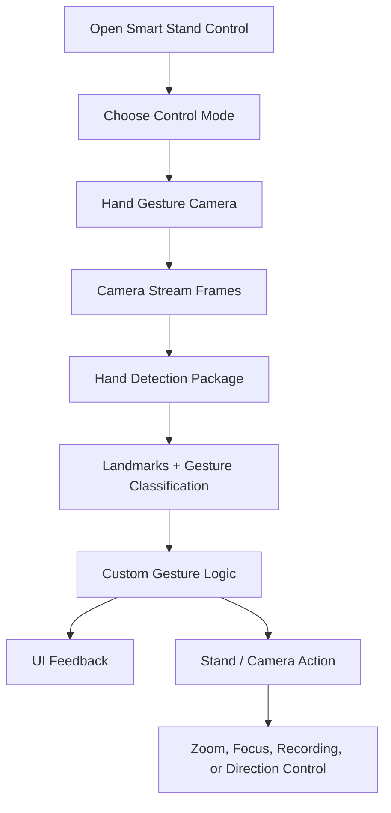

# Smart Stand Control

<p align="center">
  
</p>

<p align="center">
  A Flutter camera app for controlling a smart mobile stand with real-time hand gesture detection.
</p>

<p align="center">
  <strong>Hand tracking</strong> · <strong>Gesture commands</strong> · <strong>Camera zoom</strong> · <strong>Video recording</strong> · <strong>Smart stand control</strong>
</p>

> You can use local images from `docs/images/` or GitHub uploaded image links like `https://github.com/user-attachments/assets/...`.

## Preview

Use this section to show the most important app interfaces. Replace each `src` with your GitHub uploaded image URL when you add new screenshots.

> Note: GitHub README pages may ignore inline `style`, but `width` and `height` work reliably. Keep the style in the template if you also view the README in editors that support it.

| Home / Mode Selection | Live Gesture Detection | Recording Controls |
| --- | --- | --- |
|  |  |  |
| Choose Automatic Detect, Hand Gesture, or Voice Command. | Track hands, landmarks, gesture labels, and confidence in real time. | Start, pause, continue, and stop recording using gesture actions. |

| Hand Focus Mode | Zoom Control | Camera Permission / Loading |
| --- | --- | --- |
|  |  |  |
| Keep the selected hand centered and highlighted. | Adjust camera zoom with gestures or the floating zoom control. | Clear states for initialization, permission, retry, and camera failure. |

## What It Does

Smart Stand Control turns a phone camera into a gesture-driven remote for a smart mobile stand. The app detects hands from the live camera stream, reads hand landmarks, understands gesture patterns, and turns those gestures into stand-control actions.

The experience is built around fast visual feedback: users can see hand landmarks, current gesture status, confidence, detected hand count, zoom state, and recording state directly on top of the camera preview.

## Core Features

| Feature | Description |
| --- | --- |
| Control mode home | A polished mode picker for Automatic Detect, Hand Gesture, and Voice Command workflows. |
| Real-time hand detection | Uses the `hand_detection` package to detect hands, bounding boxes, landmarks, handedness, and gesture confidence from camera frames. |
| Direction gestures | Detects directional hand movement for left, right, up, and down control actions. |
| Custom gestures | Recognizes app-specific actions such as start recording, pause video, detect face, and return to the main position. |
| Follow-hand mode | Highlights the tracked hand and updates camera focus/exposure around the hand position. |
| Gesture zoom | Supports zoom-in and zoom-out gestures, plus a manual floating zoom controller. |
| Video recording flow | Includes gesture-based recording start, pause, continue, and stop behavior with clear loading states. |
| Camera switching | Supports front/back camera switching and keeps preview, overlays, and detection behavior aligned across platforms. |
| iOS and Android support | Handles platform-specific camera frame formats and preview coordinate mirroring. |

## Gesture Actions

| Gesture / Motion | App Response |
| --- | --- |
| Move hand left | Shows `Moving left` and can drive left stand movement. |
| Move hand right | Shows `Moving right` and can drive right stand movement. |
| Move hand up | Shows `Moving up` and can drive upward stand movement. |
| Move hand down | Shows `Moving down` and can drive downward stand movement. |
| OK gesture | Starts video recording. |
| Punch gesture | Pauses video recording. |
| Victory gesture | Ends video recording. |
| Call-me gesture | Starts face-detection/follow intent. |
| Index circle | Returns the stand to the main position. |
| Closed/open zoom gesture | Applies camera zoom in or zoom out. |

## App Flow



## GitHub Image Template

After uploading an image to a GitHub issue, pull request, or README editor, copy the generated `user-attachments` URL and paste it into the `src`.

```html

```

Suggested screenshot slots:

```text
Home / Mode Selection
Live Gesture Detection
Recording Controls
Hand Focus Mode
Zoom Control
Camera Permission / Loading
```

Recommended screenshot tips:

- Use real app screens, not cropped code screenshots.
- Keep phone screenshots the same size for a clean gallery.
- Prefer bright, readable images where the camera overlay, gesture label, and controls are visible.
- If a screen has private information, blur it before placing it in `docs/images/`.

## Tech Stack

| Layer | Tools |
| --- | --- |
| Framework | Flutter |
| Language | Dart |
| Camera | `camera` |
| Hand detection | `hand_detection` |
| Permissions | `permission_handler` |
| Platforms | Android and iOS |

## Project Structure

For a guided map of where each feature lives, see [`PROJECT_STRUCTURE.md`](PROJECT_STRUCTURE.md).

Key areas:

```text
lib/
  hand_gesture_features/
    data/factories/          Hand detector creation
    domain/constants/        Gesture thresholds
    domain/services/         Gesture detection logic
    presentation/painters/   Camera overlay and landmark painters
    presentation/screens/    Live camera screen and screen parts
    presentation/widgets/    Reusable UI components
```

## Development

This project is pinned to Flutter through FVM. Use the pinned toolchain:

```sh
fvm flutter pub get
fvm flutter analyze
fvm flutter test
```

Run the app:

```sh
fvm flutter run
```

## Platform Notes

### iOS

- Requires camera permission in `ios/Runner/Info.plist`.
- Uses `ImageFormatGroup.yuv420` for live detection frames.
- Front-camera overlay mirroring is handled separately from Android so iOS gestures and drawings stay aligned.

### Android

- Requires camera permission in `android/app/src/main/AndroidManifest.xml`.
- Uses `ImageFormatGroup.yuv420` for live detection frames.
- Preview rotation and front-camera mirroring are handled for recording and live overlays.

## Android Release Signing

Copy `android/key.properties.example` to `android/key.properties` and fill it with your local release keystore values before building a release app bundle.

Do not commit real signing secrets.

## About

Smart Stand Control is designed for hands-free camera and stand control. It combines live computer vision with a simple mobile interface so users can move, follow, zoom, and record without touching the screen.
